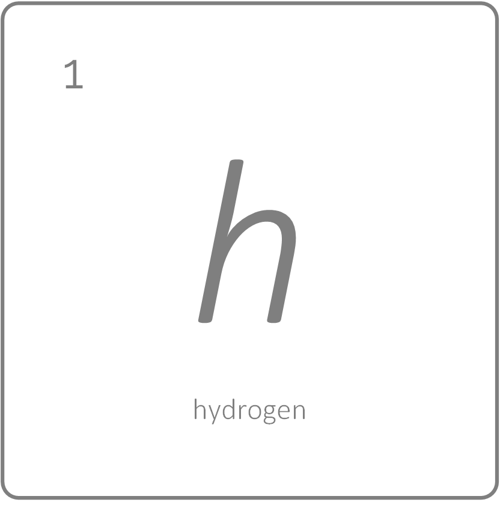

<h1 align='center'>hydrogen</h1>

<p align='center'>An interactive CLI tool for WSO2 Servers</p>

<br>

<br>

<p align="center">
  
</p>

<br>

<br>

[](https://circleci.com/gh/athiththan11/hydrogen)

[:construction: Work In Progress]

<br />

## Intro

A command line tool to alter and configure fresh packs of WSO2 products for different requirements. The `hydrogen` supports to perform the following alterations and configurations ...

* Replace H2 databases of WSO2 IS with other supported databases
* Configure API manager for distributed deployment
* Configure API manager and IS as Keymanager

& more on the way.

Checkout for more on [**Hydrogen WiKi**](https://github.com/athiththan11/hydrogen/wiki) & [**Hydrogen Project**](https://github.com/athiththan11/hydrogen/projects).

<br />

## Table of Contents

- [Intro](#intro)
- [Table of Contents](#table-of-contents)
- [Install & Run](#install--run)
	- [Troubleshoot](#troubleshoot)
- [Commands](#commands)
	- [Datasource](#datasource)
		- [datasource:is](#datasourceis)
	- [Distribute](#distribute)
		- [distribute:am](#distributeam)
- [Examples](#examples)
	- [Datasource Examples](#datasource-examples)
	- [Distribute Examples](#distribute-examples)
- [License](#license)

<br />

## Install & Run

> You don't need to install NodeJS to use the `hydrogen`, since the packages and dependencies are compressed and provided as `tar` objects. If in need to rebuild and use the `hydrogen`, then the recomended version of NodeJS is `v8.9`. **{ Node v8.9.0 Recomended }**

Download the `tar` file according to your environment from [here](https://github.com/athiththan11/hydrogen/releases). Extract and place it in your favourite location and set the `$PATH` variable to point the `/bin` folder of `hydrogen`.

To verify, fire up a terminal and execute the following command

```shell
hydrogen --version
```

### Troubleshoot

If you encounter a similar error trace as following while running the tool, Please follow the given steps to solve it.

```shell
Error: /node_modules/libxmljs/build/xmljs.node: invalid ELF header
	at bindings (~/node_modules/bindings/bindings.js:84:48)
	at Object.<anonymous> (~/node_modules/libxmljs/lib/bindings.js:1:99)
```

* Check your locally installed Node version. If you have no Node installed or if you have any higher versions than v8.9, then install Node v8.9.0 using NVM (nvm helps to manage and run different node versions)
* Delete the `node_modules` folder from the `hydrogen` directory (extracted directory)
* Execute `npm install` from the root path of `hydrogen`

This will reinstall all defined dependencies and builds to work with your environment as well as with NodeJS v8.9.0 environment.

<br />

## Commands

Below listed are the available commands and descriptions of `hydrogen`.

> All altered configurations are commented with `HYDROGENERATED:` keyword. If you want to list all the applied alterations, open a configured node and search for the keyword `HYDROGENERATED:` to list all the altered configurations.

<br />

### Datasource

To list available commands of `Datasource`, execute `hydrogen datasource --help`.

```shell
Alter datasources of WSO2 products (fresh-pack) with supported datasource vendors

USAGE
  $ hydrogen [COMMAND]

DESCRIPTION
  ...
  Alter datasource configurations of WSO2 products based on your preference.

  List all available datasource commands using
  $ hydrogen datasource --help

EXAMPLE
  $ hydrogen datasource:is [FLAGS] [ARGS]

COMMANDS
  datasource:is  Alter datasources of WSO2 IS products (fresh-pack) with supported datasource models
```

`Datasource` commands are used to replace the default shipped H2 databases with other supported databases.

**NOTE** : As present the `hydrogen` only supports replacing the H2 databases of WSO2 IS packs (v5.7) and later will be expanded to cover other supported versions and products.

Click [here](#datasourceis) to jump to the WSO2 Identity Server related `datasource` commands.

> For more information on changing the H2 databases and configurations of WSO2 Packs, visit [here](https://docs.wso2.com/display/ADMIN44x/Changing+the+Carbon+Database).

#### datasource:is

To list available commands of `datasource:is`, run `hydrogen datasource:is --help`.

```shell
Alter datasources of WSO2 IS products (fresh-pack) with supported datasource models

USAGE
  $ hydrogen datasource:is [FLAGS] [ARGS]

OPTIONS
  -r, --replace                           replace h2 datasource
  -c, --container                         create docker container for datasource
  -d, --datasource=postgres|mysql|oracle  (required) datasource type
  -g, --generate                          generate databases and tables in the container
  -v, --version=5.7                       (required) [default: 5.7] wso2is product version

DESCRIPTION
  ...
  Alter datasource configurations of WSO2 IS products based on your preference.

  As of now, Hydrogen only supports replacing the default H2 datasource with a variety
  of available supported datasource models. To replace the default shipped H2 datasource,
  use --replace (-r) and pass supported datasource with --datasource flag (--datasource mysql).

EXAMPLES
  Replace H2 with Postgres
  $ hydrogen datasource:is --replace -v 5.7 -d postgres
  Replace H2 with Postgres and generate a container for database
  $ hydrogen datasource:is --replace -v 5.7 -d postgres --container --generate
```

`datasource:is` commands are used to replace the default shipped H2 databases of WSO2 IS packs with other supported databases.

As present the `hydrogen` only supports replacing the H2 databases of WSO2 IS packs (v5.7) with

* Postgres
* MySQL
* Oracle

databases, and later will be expanded to cover other supported databases and versions.

The `datasource:is` commands also do support to generate Docker containers with databases and tables while configuring the WSO2 packs. Below are the supported databases to generate Docker containers

* Posgres : `v9.6`

For usages and examples, navigate to [here](#datasource-examples).

<br />

### Distribute

To list available commands of `Distribute`, execute `hydrogen distribute --help`.

```shell
Configure WSO2 products for distributed deployments

USAGE
  $ hydrogen [COMMAND]

DESCRIPTION
  ...
  Configure WSO2 products for supported distributed deployment setups.

  As of now, Hydrogen only supports WSO2 APIM products to distribute it in either 5 nodes
  distributed setup or as publish through multiple gateway setup.

  List all available distribute commands using
  $ hydrogen distribute --help

EXAMPLE
  $ hydrogen distribute:am [FLAGS] [ARGS]

COMMANDS
  distribute:am  Configure WSO2 APIM products (fresh-pack) for distributed deployments
```

`Distribute` commands are used to configure the WSO2 packs for distributed deployment setups.

**NOTE** : As present the `hydrogen` only supports distributed WSO2 API Manager packs (v2.6) and later will be expanded to cover other supported versions and distributions.

Click [here](#distributeam) to jump to the WSO2 API Manager related `distribute` commands.

> For more information on configuring WSO2 API Manager for distributed environments, visit [here](https://docs.wso2.com/display/AM260/Deploying+WSO2+API+Manager).

#### distribute:am

```shell
Configure WSO2 APIM products (fresh-pack) for distributed deployments

USAGE
  $ hydrogen distribute:am

OPTIONS
  -D, --distributed       5 node distributed setup
  -I, --is-km             IS as Keymanager setup
  -M, --multiple-gateway  publish through multiple gateway

DESCRIPTION
  ...
  Configure WSO2 APIM products for distributed deployments setup based on your preference.

  As of now, Hydrogen only supports configurations for 5 node distributed deployment setup,
  and publish through multiple-gateway node setup. For 5 node distribution, use --distributed (-D)
  flag, and for multiple-gateway node, use --multiple-gateway (-M) flag.

EXAMPLES
  Configure APIM for 5 node distributed setup
  $ hydrogen distribute:am -D -v 2.6
  Configure APIM for publish through multiple-gateway setup
  $ hydrogen distribute:am -M -v 2.6
```

`distribute:am` commands are used to configure the WSO2 API Manager packs for distributed deployment setups.

As present the `hydrogen` only supports configuring distributed setups for WSO2 API Manager (v2.6) packs with

* 5 node distributed deployment
* Publish through multiple gateways
* IS as Keymanager

setups, and later will be expanded to cover other supported deployment patterns and configurations.

> **NOTE** : The `distribute:am` commands **are not** enhanced to create databases and to generate containers for databases and tables for the distributed environments.

<br />

## Examples

### Datasource Examples

* Need to configure WSO2 IS v5.7 with `Postgres` by replacing the default shipped H2 Carbon database
  * Download and extract a fresh pack of WSO2 IS v5.7
  * Open a terminal and navigate to the root of the extracted WSO2 IS pack
  * Execute the following

	```shell
	# inside wso2is-5.7.0
	hydrogen datasource:is --replace --datasource postgres --version 5.7
	```

* Need to configure WSO2 IS v5.7 with `Postgres` by replacing the default shipped H2 Carbon database and also to generate a Docker container with databases
  
  **NOTE** : Docker images are not pulled from the DockerHub (as of now in beta version & will be added as enhancement in near future). Prior to execute the command pull the Postgres:9.6.14 image from DockerHub

  * Download and extract a fresh pack of WSO2 IS v5.7
  * Start the Docker service in your environment (if you don't have Docker intalled, install Docker before executing the command to work without any errors)
  * Open a terminal and navigate to the root of the extracted WSO2 IS pack
  * Execute the following

	```shell
	# inside wso2is-5.7.0
	hydrogen datasource:is --replace --datasource postgres --version 5.7 --container --generate
	```
	The above command will create a `Postgres` Docker container with a random name (an animal name) with the databases and tables.

### Distribute Examples

* Need to configure a 5 node distributed setup with WSO2 API Manager v2.6 pack
  * Download and extract a fresh pack of WSO2 API Manager v2.6 inside a new directory (only containing the extracted WSO2 API Manager pack)

	```tree
	- MyNewFolder
    	|- wso2am-2.6.0
	```

  * Open terminal and navigate to the parent folder of the extracted WSO2 APIM pack
  * Execute the following

	```shell
	# inside MyNewFolder
	hydrogen distribute:am --distributed --version 2.6
	```

	The above command will create a new folder named `distributed` and places all configured 5 nodes within it.

* Need to configure WSO2 API Manager v2.6 for [publish through multiple-gateway](https://docs.wso2.com/display/AM260/Publish+through+Multiple+API+Gateways) setup.
  * Download and extract a fresh pack of WSO2 API Manager v2.6 inside a new directory (only the extracted WSO2 API Manager pack)

	```tree
	- MyNewFolder
    	|- wso2am-2.6.0
	```

  * Open terminal and navigate to the parent folder of the extracted WSO2 APIM pack
  * Execute the following

	```shell
	# inside MyNewFolder
	hydrogen distribute:am --multiple-gateway --version 2.6
	```

	The above command will create a new folder named `distributed` and places all configured nodes within it.

* Need to configure WSO2 API Manager v2.6 with IS-KM v5.7
  * Download and extract both WSO2 API Manager v2.6 and IS-KM v5.7 inside a new directory (only the extracted WSO2 APIM pack & the IS-KM pack)

	```tree
    - MyNewFolder
		|- wso2am-2.6
		|- wso2is-km-5.7.0
	```

  * Open a terminal and navigate to the parent folder of the extracted packs
  * Execute the following

	```shell
	# inside MyNewFolder
	hydrogen distribute:am --is-km --version 2.6
	```

<br />

## License

Licensed under [MIT](https://github.com/athiththan11/hydrogen/blob/master/LICENSE).
